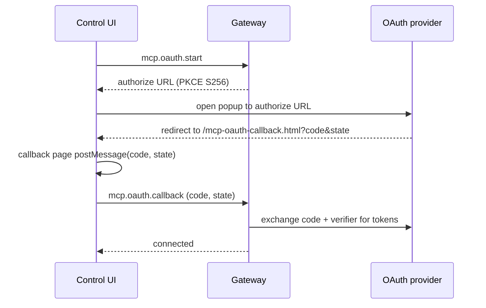

Remote MCP servers increasingly require OAuth 2.0 instead of a static bearer
token. Genesis runs the authorization-code flow from the Control UI, stores the
resulting tokens encrypted on the gateway host, and refreshes them
automatically.

## Flow



1. The operator clicks **Connect** on an OAuth-required server in the Control UI.
2. `mcp.oauth.start` builds the provider authorize URL. Genesis generates a PKCE
   verifier and sends the S256 challenge; the verifier is bound to the request
   `state` and never leaves the gateway.
3. A popup opens the provider consent screen. After consent the provider
   redirects to the gateway-served callback page at `/mcp-oauth-callback.html`.
4. The callback page posts the `code` and `state` back to the Control UI. The UI
   only accepts that message when it comes from the gateway origin (see
   [Callback origin checks](#callback-origin-checks)).
5. `mcp.oauth.callback` exchanges the code (plus the PKCE verifier and any client
   secret) at the token endpoint and stores the resulting tokens.

## Token storage

Tokens live on the gateway host, never in the browser:

- File: `~/.genesis/mcp-oauth.json`, written atomically with `0600` permissions.
- Encryption: the file is encrypted at rest with AES-256-GCM under a
  machine-local key at `~/.genesis/mcp-oauth.key` (also `0600`). If the key is
  missing or the file cannot be decrypted, Genesis treats the server as
  not connected and never deletes the file, so an operator can investigate.
- Redaction: server configs written to logs strip `auth.clientSecret` and any
  `Authorization` header.

Legacy plaintext stores from earlier builds are read transparently and
re-encrypted on the next write.

## Refresh and revoke

- Tokens are refreshed automatically when a request finds them within 60 seconds
  of expiry, using the stored refresh token (RFC 6749 section 6). A new refresh
  token is adopted when the provider issues one; otherwise the existing one is
  kept.
- `mcp.oauth.refresh` (admin scope) forces a refresh on demand.
- Disconnecting a server makes a best-effort RFC 7009 revocation call when a
  `revokeUrl` is known, then removes the local token. Revocation failures never
  block disconnect.

## Discovery

When you add a server by link, Genesis probes it for OAuth requirements:

1. The standard `/.well-known/oauth-authorization-server` and
   `/.well-known/openid-configuration` metadata under the server origin.
2. RFC 9728 `/.well-known/oauth-protected-resource`, following the first
   advertised authorization server to its metadata.
3. An unauthenticated `initialize` probe. A `401` with a `WWW-Authenticate:
Bearer` challenge (or a JSON-RPC authorization error) marks the server as
   OAuth-required and, when present, the `resource_metadata` hint is followed.

## Manual configuration

If a provider is not auto-detected, set the auth block directly under
`mcp.servers.<name>.auth` (JSON tab in the Control UI, or the config file):

```json
{
  "mcp": {
    "servers": {
      "notion": {
        "url": "https://mcp.notion.com/mcp",
        "auth": {
          "authorizeUrl": "https://api.notion.com/v1/oauth/authorize",
          "tokenUrl": "https://api.notion.com/v1/oauth/token",
          "clientId": "your-registered-client-id",
          "clientSecret": "your-client-secret",
          "scopes": ["read", "write"],
          "revokeUrl": "https://api.notion.com/v1/oauth/revoke",
          "usePkce": true
        }
      }
    }
  }
}
```

- `clientId` must be the id you registered with the provider. When omitted,
  Genesis falls back to a generic identifier that most providers will reject.
- `usePkce` defaults to `true`. Set it to `false` only for providers that do not
  support PKCE.
- `clientSecret` is optional for public clients that rely on PKCE alone.

## Self-hosted servers

Outbound metadata and OAuth requests are SSRF-guarded: by default Genesis blocks
private, loopback, link-local, and other internal addresses, and pins DNS to
prevent rebinding. To reach an MCP server on a private network, allow its
hostname explicitly:

```json
{
  "mcp": {
    "metadataFetch": {
      "allowedHosts": ["mcp.internal.example"]
    }
  }
}
```

Listing a host exempts it from the private-address block. Leave this empty unless
you operate the target server.

## Callback origin checks

The callback page is served same-origin by the gateway. The Control UI accepts a
callback message only when it carries the Genesis source tag and originates from
the gateway web origin. When a browser reports an opaque origin for the popup,
the UI falls back to verifying the message came from the popup window it opened.
This prevents a malicious page from injecting a forged authorization code.

## Related

- [MCP CLI and server definitions](/cli/mcp)
- [Gateway remote access](/gateway/remote)
- [Troubleshooting](/help/troubleshooting)
